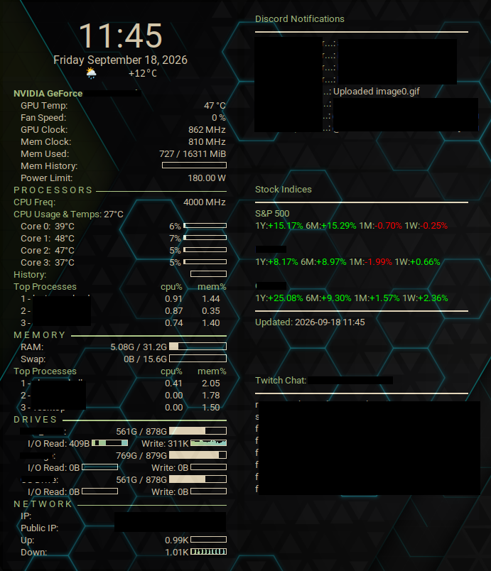

# Conky Desktop Widgets

A set of [Conky](https://github.com/brndnmtthws/conky) desktop widgets for Linux, showing system info, clock/weather, live stock indices, Twitch chat, and Discord notifications on the desktop.

## Widgets

- **general/** — Clock, date, weather, and system stats (CPU, RAM, disk, etc.)
- **stock/** — Stock index performance (S&P 500, DAX, OMX30 by default) fetched via `yfinance`
- **twitch_chat/** — Live Twitch chat overlay, read from a configured channel via IRC
- **discord/** — Discord notification feed, captured from D-Bus

## Setup

1. Copy `.env.example` to `.env` and fill in your paths and settings:
   - `CONKY_DIR` — path to this config directory
   - `STOCK_VENV` — path to a Python venv with `yfinance` installed
   - `WEATHER_LAT` / `WEATHER_LON` — coordinates for the weather widget
   - `MOUNT_STORAGE_PATH` / `MOUNT_OS2_PATH` — mount points shown in system stats
   - `STOCK1_INDEX` / `STOCK1_LABEL` (and `STOCK2`/`STOCK3`) — which indices to display (available: `sp500`, `dax`, `omx30`)
2. Set your Twitch channel in `twitch_chat/config.txt`.
3. Run `./start_conky.sh` to launch all widgets (kills any existing instances first).

## Credits

- **Titus**: https://github.com/ChrisTitusTech/titus-conky
